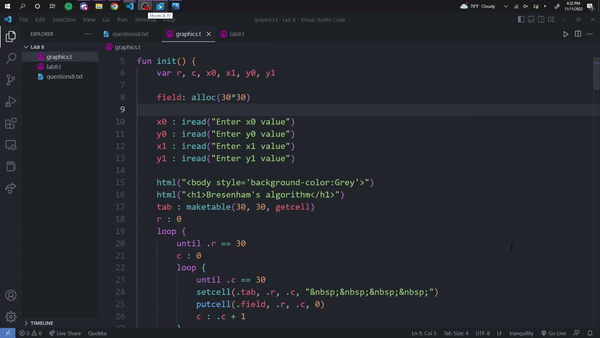

# Language-Tranquility
The `language-tranquility` extension for Visual Studio Code provides language support for the Tranquility language developed at Drexel University by Professor Brian Stuart.

## Features
The extension ships with several features, including
 - Syntax highlighting
 - Documentation hovering
    - Docuentation for built-in functions
    - Documentation for reserved keywords
 - Linting
    - Errors
        - Unrecognized token type
        - Unexpected token type
        - Referencing an variable that is not defined
        - Duplicate identifier names (including naming a function/variable to the name of a built-in function)
        - Calling a function with the incorrect number of arguments
        - Creating a loop without an `until` statement
    - Warnings
        - Unused variables

<p align="center">
    
<p>

## Windows Setup

The Tranquility compiler is a Linux executable and a native version for Windows does not exist. As such, any Windows users will have to adjust certain parts of their code to be Linux-compatible and compile/run the files themselves on a virtual Linux machine.

### Newlines
If you are on Windows, you will need to ensure your new lines do not include carriage returns. On MacOS and Linux, new lines are written as `\n`, but on Windows they include a carriage return and are coded as `\r\n`. The Tranquility compiler is written in Linux and unlike most languages does not ignore new lines, and specifically expects `\n` characters. To set newlines to only `\n` in Visual Studio Code:
- Navigate to `%appdata% > Code > User > settings.json`
- Enter the following line in the top-level of the file:
```json
{
    ...
    "files.eol": "\n",
    ...
}
```
Visual Studio Code will now process new lines as `\n`. This is necessary to write Tranquility code. If you're in an existing project that had carriage returns by default, press the `CRLF` button in the bottom right of the window and switch to `LF`.

### Compilation
Compiling Tranquility is only possible on a Linux machine. To compile tranquility on windows, it is most common to use [Windows Subsystem for Linux (WSL)](https://learn.microsoft.com/en-us/windows/wsl/about). Start by [installing WSL](https://aka.ms/wslstore). 

Next, NodeJS and the `wget` command need to be installed:

```bash
>> wsl
$ cd ~
$ sudo apt-get install nodejs
$ sudo apt-get install wget
```

Next, the Tranquility run command must be registered. Download `setup.bash` and place it anywhere. In the location of the setup file, open CMD or Powershell, run `wsl` to enter WSL, and run `bash ./setup.bash`. This will download all of the necessary scripts; Specifically the tranquility compiler, MTVM, and the tranquility runner. After this operation is complete you can delete `setup.bash` by navigating to the folder you put it in (if you're not already there) and running `rm setup.bash`. Each time you want to compile, run `wsl`.

## Usage
To compile, run `tranquility <filename>.t`.

